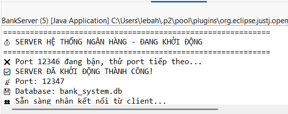
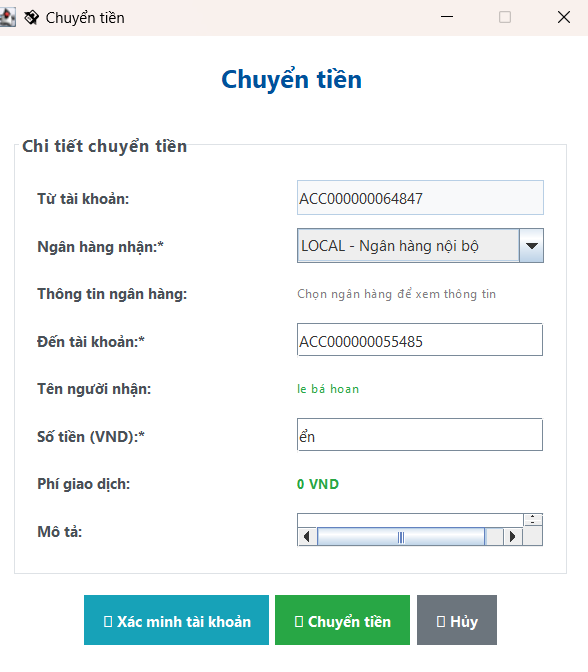
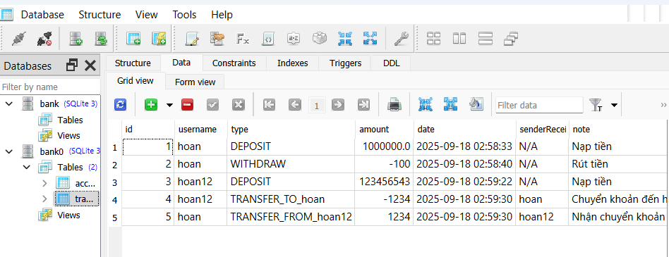

<h2 align="center">
    <a href="https://dainam.edu.vn/vi/khoa-cong-nghe-thong-tin">
    🎓 Faculty of Information Technology (DaiNam University)
    </a>
</h2>
<h2 align="center">
   Hệ thống quản lý ngân hàng mini
</h2>
<div align="center">
    <p align="center">
        
        
        
    </p>

[](https://www.facebook.com/DNUAIoTLab)
[](https://dainam.edu.vn/vi/khoa-cong-nghe-thong-tin)
[](https://dainam.edu.vn)

</div>


## 📖 1. Giới thiệu
Ứng dụng này mô phỏng một hệ thống ngân hàng sử dụng kiến trúc **Client-Server**, cho phép người dùng thực hiện các thao tác ngân hàng như gửi tiền, rút tiền, chuyển khoản và xem lịch sử giao dịch, đồng thời cung cấp các chức năng quản trị để quản lý tài khoản.

- **Server**: Đóng vai trò trung tâm, quản lý tài khoản người dùng, giao dịch và xử lý các yêu cầu từ Client. Sử dụng cơ sở dữ liệu SQLite để lưu trữ dữ liệu tài khoản và giao dịch. 
- **Client**: Cung cấp giao diện người dùng cho khách hàng và quản trị viên để tương tác với hệ thống ngân hàng, bao gồm đăng nhập, đăng ký và các thao tác ngân hàng khác. 


**Mục tiêu chính:**  
- Hiểu nguyên lý hoạt động của giao thức TCP khi truyền dữ liệu.  
- Thực hành xây dựng giao diện ngân hàng an toàn và thân thiện với người dùng bằng **Java Swing**.  
- Triển khai các thao tác cơ sở dữ liệu để lưu trữ và quản lý dữ liệu tài khoản và giao dịch. 
- Hỗ trợ nhiều Client kết nối đồng thời bằng cách sử dụng đa luồng 

**Các chức năng chính:**  
- Xác thực người dùng (đăng nhập/đăng ký).  
- Các thao tác ngân hàng: gửi tiền, rút tiền, chuyển khoản.
- Xem lịch sử giao dịch.
- Chức năng quản trị: liệt kê tài khoản, đặt lại mật khẩu, khóa/mở khóa tài khoản, xem thống kê và lịch sử giao dịch.
- Hỗ trợ nhiều Client kết nối cùng lúc.  

---

## 🛠️ 2. Công nghệ sử dụng  

- **Ngôn ngữ lập trình**: Java (JDK 8+).  
- **Giao thức mạng**: TCP Socket (`java.net.Socket`, `java.net.ServerSocket`).  
- **Xử lý đa luồng**: `Thread` để phục vụ nhiều Client đồng thời.  
- **Công nghệ giao diện**: Java Swing (JTable, JButton, JTextArea, JSplitPane).  
- **Cơ sở dữ liệu**: SQLite (jdbc:sqlite) để lưu trữ lâu dài dữ liệu tài khoản và giao dịch.
- **Thư viện sử dụng**:  
  - `java.net`  
  - `java.io`  
  - `javax.swing`, `java.awt`
  - `java.sql`
  - `com.formdev.flatlaf.FlatLightLaf`  
- **Công cụ phát triển**: IntelliJ IDEA / Eclipse / NetBeans (tùy chọn).  
- **Phiên bản JDK**: Java SE (JDK 8 trở lên).  
- **Hệ điều hành**: Hỗ trợ đa nền tảng (Windows, Linux, macOS).  


---

## 🚀 3. Một số hình ảnh hệ thống
### Giao diện Server

<p align="center">
  
</p>
<p align="center"><i>Hình ảnh 1</i></p>

### Giao diện đăng nhập Client

<p align="center">
  
</p>
<p align="center"><i>Hình ảnh 2</i></p>

### Giao diện đăng kí Client

<p align="center">
  
</p>
<p align="center"><i>Hình ảnh 3</i></p>

### Giao diện điều khiển Client

<p align="center">
  
</p>
<p align="center"><i>Hình ảnh 4</i></p>

### Giao diện giao diện chuyển tiền Client

<p align="center">
  
</p>
<p align="center"><i>Hình ảnh 5</i></p>

### Giao diện Quản trị

<p align="center">
  
</p>
<p align="center"><i>Hình ảnh 6</i></p>

### Giao diện database

<p align="center">
  
</p>
<p align="center"><i>Hình ảnh 5</i></p>N

---

## 📝 4. Các bước cài đặt

#### Bước 1: Chuẩn bị môi trường
1. **Kiểm tra Java**: Mở terminal/command prompt và chạy:
```bash
java -version
javac -version
```
Đảm bảo cả hai lệnh đều hiển thị phiên bản Java 8 trở lên.
Thiết lập cơ sở dữ liệu:
Ứng dụng sử dụng cơ sở dữ liệu SQLite (data/bank_system.db). Đảm bảo thư mục data tồn tại trong thư mục gốc của dự án, nếu không, nó sẽ được tạo tự động.

#### Bước 2: Biên dịch mã nguồn
1. Mở terminal và điều hướng đến thư mục chứa mã nguồn.
2. Biên dịch các file Java:
```bash
javac server/.java server/models/.java
javac client/.java
```
- Hoặc biên dịch toàn bộ dự án:
```bash
javac LTM-1604-D19-Chat-TCP/**/*.java
```
3. Kiểm tra kết quả: Dảm bảo các file `.class` được tạo thành công.

#### Bước 3: Chạy ứng dụng
Khởi động Server:
```bash
java server.BankServer
```
- Server tạo cơ sở dữ liệu SQLite (data/bank_system.db)nếu chưa tồn tại. 
- SKhởi tạo tài khoản quản trị mặc định (tên đăng nhập: admin, mật khẩu: admin123).
- Server lắng nghe trên cổng 12345. 
- Log hiển thị các kết nối Client và hoạt động của server.

Khởi động Client:
```bash
java clienta..BankClient
```
- Client kết nối đến server tại localhost:12345 (có thể cấu hình trong BankClient.java).
- Giao diện đăng nhập (LoginUI) xuất hiện, cho phép người dùng đăng nhập hoặc đăng ký.
### 🚀 Sử dụng ứng dụng
1. Khởi động Server: Chạy BankServer để chấp nhận các kết nối từ Client.
2. Đăng nhập Client: 
- Nhập tên đăng nhập và mật khẩu trong LoginUI.
- Nhấn "Đăng ký" để tạo tài khoản mới qua RegisterUI.
3. Thao tác người dùng (DashboardUI):
 - Gửi/Rút tiền: Nhập số tiền để gửi hoặc rút.
 - Chuyển khoản: Chỉ định tên đăng nhập người nhận và số tiền chuyển.
 - Xem lịch sử: Hiển thị lịch sử giao dịch dưới dạng bảng.
3. Thao tác quản trị (AdminUI): 
 - Liệt kê tài khoản: Xem tất cả tài khoản với thông tin chi tiết (tên đăng nhập, họ tên, số dư, trạng thái).
 - Đặt lại mật khẩu: Đặt lại mật khẩu cho người dùng.
 - Khóa/Mở khóa tài khoản: Chuyển đổi trạng thái tài khoản.
 - Xem thống kê: Xem tổng số dư và số lượng giao dịch.
 - Xem lịch sử giao dịch: Kiểm tra lịch sử giao dịch của bất kỳ người dùng nào.
4. Đăng xuất: Đăng xuất và quay lại màn hình đăng nhập.
5. Kết nối lại: ếu mất kết nối, Client tự động cố gắng kết nối lại với server.

---

## 5. Liên hệ cá nhân
Nếu có bất kỳ thắc mắc hoặc cần hỗ trợ, vui lòng liên hệ:

- 👨‍🎓 Họ và tên: Lê Bá Hoan
- 🏫 Khoa: Công nghệ thông tin - Trường đại học Đại Nam
- 📧 Email: lebahoan1812@gmail.com

© 2025 AIoTLab, Faculty of Information Technology, DaiNam University. All rights reserved.


